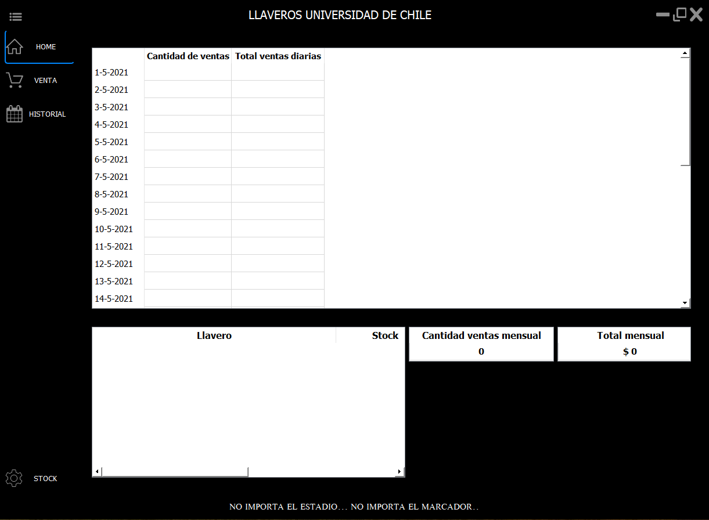

# Llaveros-UdeChile
App para manejo de ventas y stock de Llaveros UdeChile

## Construido con 🛠️

* [Python 3.9](https://www.python.org)
* [SQLite](https://www.sqlite.org/index.html)
* [PyQt5](https://pypi.org/project/PyQt5/)

## Captura de la interfaz gráfica

## Llaveros Universidad de Chile

*  

## Autor ✒️

* **Nicolás Rivas** [nrivas2017](https://github.com/nrivas2017)